# rvgp - A plain text accounting framework for ruby on rake. 
What follows is a workflow tool, and accounting framework, to: 
1. **R**econcile your bank-downloaded csv's into categorized pta journals. 
1. **V**alidate the accounting, to protect against errors. 
1. **G**rid the data! Make 'spreadsheets' based on analytic calculations from your journals.
1. **P**lot your grids, and generate meaningful graphs of your finances.

Plus more! There's a bunch of tools included for: managing commodities, working with tables, parse journals... too much to list. There's plenty of ruby goodness inside to save you time with your accounting, and keep you from reinvent wheels.

# 📑 Table of Contents

- [The Quick Pitch](#-the-quick-pitch)
- [Getting Started](#-getting-started)
- [How do project files relate?](#-how-do-project-files-relate)
- [Understanding the Workflow](#-understanding-the-workflow)
- [Documentation](#-documentation)
- [License](#-license)

# 📽 The Quick Pitch
If you like ruby, and you want something akin to rails... but for your finances - this is what you're looking for! This tool offers an easy workflow,
for the ruby literate, to: 

1. Build PTA Journals, given a csv, and applying reconciliation rules from a provided yaml file
2. Run validations (provided in ruby) to ensure the journals meet your expectations
3. Generate Pretty Plots! using either gnuplot, or Google sheets. Take a look:

| Gnuplot Output                                              |
| :---                                                        |
|           |
|  |

Or, publish to google, and share it with your accountant:

| 2022 Cashflow (Google Sheet Screenshot)                          |  Wealth Report (Google Sheet Screenshot)                                   |
| :---                                                             |  :----                                                                     |
|  |   |

Plus, you get a bunch of other nice features. Like...
* A TUI cashflow output, for understanding your monthly cashflow on a dashboard
* Lots of versatility in your Plots. The code is very open ended, and supports a good number of 2d plot formats, and features
* No extraneous gem dependencies. Feel free to include activesupport in your project if you'd like. But, we're not imposing that on our requirements!
* A Reconciliation mode in vim, to split-screen edit your yaml, with a hot-loaded output pane
* Git friendly! Store your finances in an easily audited git repo.
* Automatic transactions, for generating transactions via ruby logic, instead of sourcing from a csv file.
* Additional modules for currency conversion, mortgage interest/principle calculations
* Add your own commands and tasks to the rake process, simply by adding commands them your app/commands folder
* Multi-threaded for faster throughput
* An easy quickstart generator, for setting up your first project (see the new_project command)
* Shortcuts for working with finance, currency, gnuplot, hledger, i18n and more 

# 🐦‍ Getting Started

The quickest way to get started, once you've installed the gem, is by way of the 'new_project' command.  
```
~> rvgp -d ~/ledger new_project
Whose project is this? A person's full name or a company name will work: Yukihiro Matsumoto
You entered "Yukihiro Matsumoto". Is that correct? (Type "Yes" to continue) : Yes

📖 New Project
   Initializing Project directory ........................................... 🟢
   Initializing Randomized bank feeds ....................................... 🟢
   Initializing Randomized reconcilers ...................................... 🟢

The new project has been generated successfully.
Though you may want to add the following line to your ~/.bashrc:
  export LEDGER_FILE="/home/matz/yukihiro-matsumoto.journal"

You're ready to begin working on this project. Try cd'ing into its directory, and running `rake`.
~>
```

Per the suggestion, you'll benefit from adding the LEDGER_FILE environment variable to your shell's startup script. This will keep you from having to specify the directory every time you run rvgp (or having to specify it to ledger and hledger). If you're working with more than one project, you may not want to use this feature. 

> **Note**
> You can specify a company name, instead of person's name. (If that's what you're intent on managing with this project)

From here, you're all set to run your first build. cd into your project directory, and run rake. Here's roughly the output you can expect. We abridged this a bit, to cut down on ... paper :smiley: . Your output may differ, in any case, depending on how your cpu decides to schedule threads:
```
~> cd ~/ledger
~/ledger> rake
🏗️ Building Journals from Feeds
   Expanding Personal AcmeBank:Checking (2018) .............................. 🟢
   Expanding Personal AcmeBank:Checking (2023) .............................. 🟢

📒 Inspecting Individual Journal Files
   Validating Personal AcmeBank:Checking (2018) ............................. 🟢
   🟡 No balance checkpoints found.
   Validating Personal AcmeBank:Checking (2023) ............................. 🟢
   🟡 No balance checkpoints found.

▦ Generating Grids
   Calculating Cashflows by month (2018) .................................... 🟢
   Calculating Wealth Growth by month (2023) ................................ 🟢

📈 Generating Plots
   Plotting 2018-cashflow ................................................... 🟢
   Plotting all-wealth-growth ............................................... 🟢

~/ledger>
```

The output of this process, is now visible in the `build` folder under your project's root. 

> **Note**
> The "No balance checkpoints found." warning indicates that your reconciler definition, is missing a balance checkpoint. Since new_projects use 'fake' data, there's no balance checkpoint specified in the reconciler yaml. With your data, you'll want to enter the balance, and date, on some of your statements, into the 'balances' section of this file, to ensure accuracy against the financial institution's records. (Or, you can just disable this feature) More on that later. Nonetheless, these warnings are safe to ignore for now.

Now you can begin to explore your build. If you'd like to see the net worth of your project, try running `gnuplot build/plots/all-wealth-growth.gpi`. If you'd like to publish some plots to google, you can populate your config/ directory with google API settings, and run `rvgp publish_gsheets -a`. Or, just run a `hledger bal` (or `ledger bal`) to see your account balances.
   
From here, you're ready to start populating this project with your data, instead of the randomly generated feeds. The easiest way to get started, is to run a `rake clean` (Thus undo'ing the above rake work, and clearing the build/ directory). And to then, remove unnecessary files in your `feeds/` and `app/reconcilers/` directories. Go ahead from there, and download your banking institution's csv files into the `feeds/` directory. And create yaml files for each of them, in your `app/reconcilers` directory. Use an existing yaml file for quick reference. 

Probably though, you'll want to read the rest of this README, to better understand how the project workflow is structured, and how these files work with that process.

# 🐒 How do project files relate?
Let's take a moment, to understand the project directory structure. Here's what that looks like, in the "Yukihiro Matsumoto" project that we just created:

```
~/ledger> lsd *
 Rakefile   yukihiro-matsumoto.journal

app:
 commands   grids   plots   reconcilers   validations

build:
 grids   journals   plots

config:
 csv-format-acme-checking.yml   google-secrets.yml   rvgp.yml

feeds:
 2018-personal-basic-checking.csv   2020-personal-basic-checking.csv   2022-personal-basic-checking.csv
 2019-personal-basic-checking.csv   2021-personal-basic-checking.csv   2023-personal-basic-checking.csv

journals:
 opening-balances.journal   prices.db
~/ledger>
```

In the root of this project, is your 'main' journal, alongside the Rakefile, and a few directories. Let's look at these directories one by one.
* **journals** These are where your 'manually entered' PTA journals belong. As your project grows, you can insert as many .journal files in here as you'd like. These will be automatically included by the yukihiro-matsumoto.journal. And, to get you started, there is an opening-balances.journal, which, nearly every project should have.
* **feeds** This folder exists to keep your 'source' files. Which, would principally be csv's that have been downloaded from banks. PTA '.journal' files are also supported. I synchronize the journal output from [cone](https://play.google.com/store/apps/details?id=info.tangential.cone&hl=en_US&gl=US), into journal files here.
* **build** This folder, is where the output of rvgp goes. There's really no good reason to write to this folder, outside the rvgp libraries. Be careful about putting anything in here that you don't want to lose. A `rake clean` erases just about anything that's in here. We'll better address this folder, by examining the app folder, a bit further down.
* **app** Here's where the magic happens. This folder contains the ruby and yaml, that reconciles the contents of your feeds, into a finished product. There are a number of subfolders, each containing logic dedicated to a specific part of the build process. (See below) 
* **config** This is self explanatory. This directory exists to contain application feed settings. You can look through the default config files, for an overview of what's possible here.

Drilling into the app folder, we see the following sub-folders:

* **app/reconcilers** This folder contains yaml files, which are used to reconcile your feeds, into pta journals. These yaml files support an extensive featureset to 'match entries', and then tag and categorize those matches. The output of this reconcile, is stored in the build/journals folder, once executed.
* **app/validations** This folder contains ruby files, inside which, are tests that ensure validity of the output, for the above reconcilers. These ruby files contain classes which inherit from either the RVGP::Base::SystemValidation, or, the RVGP::Base::JournalValidation, depending on whether they validate the system as a whole (Perhaps, checking for any transactions tagged 'vacation', but which aren't also tagged with a 'location'). Or, whether they are specifically designed for a given reconciler's output file. There is no build output on these files. Validations either trigger an warning on the console, or abort a build from continuing (with an error on the console).
* **app/grids** This folder contains ruby files, containing classes which build 'grids'. Grids, are csv files, that contain calculated outputs, based on your journals. These grids can be used for many purposes, but, probably should be considered 'excel sheets' that are later plotted, or referenced by a command elsewhere. Typically, these grids are composed of 'hledger monthly' queries. However, they can just as easily be generated independent of your journals. Which is useful for tracking 'business projections' and financial models that you wrote yourself. The output of these grids, are stored in your build/grids folder.
* **app/plots** This folder contains the yaml files which contain the gnuplot and google settings that draw your plots. These settings determine what will gpi files are generated in your build/plots folder.
* **app/commands** This folder contains any additional commands you wish to extend the rvgp app with. And which are then suitable for insertion into the rake workflow. These files are ruby files, containing classes which inherit from the RVGP::Base::Command object.

These directories contain the bulk of your workload, in your rvgp projects. These components will be further documented further down in this README. In the meantime, it may help to illustrate the typical workflow cycle, that rvgp executes using these files.

> **Note**
> Feel free to add as many directories to your project root as you'd like. Useful ideas for additional directories might include: 'bank statements', 'test', 'orgs', 'documents', etc

# 🪅 Understanding the Workflow

The significance of the Rakefile approach, to your accounting, can't be understated. This design decision offers us a number of features. The implicit dependency-tracking ensures that changes are only applied downstream in your build. A small adjustment at a given year, doesn't require an entire rebuild of the project. This offers us better performance, git-friendly accounting, and simplified auditing.

> **Note**
> There shouldn't be any reason to avoid, or instigate, a `rake clean` when working on a project. The Rakefile is very smart about figuring out what to change. However, if you feel the need to recalculate the entire project - a rake clean won't hurt.

To better understand how your files, are processed by rvgp, here's a diagram of how the rakefile processes your build. Hopefully this reduces confusion.

```mermaid
  graph TD;
    subgraph Reconciliation[Reconciliation Cycle]
      Reconcilers("app/reconcilers/*.yml").->JournalBuild("<br>🏗 <b>Journal Build</b><br><br>");
      Feeds("feeds/*.csv").->JournalBuild;
      JournalBuild-->JournalOutput("build/journals/*.journal");
    end
    JournalOutput-->JValidations;
    JValidationInput("app/validations/*.rb<br>(<i>RVGP::Base::JournalValidation</i>)").->JValidations;
    JValidations("<br>📒 <b>Journal Validate</b><br><br>");
    SValidationInput("app/validations/*.rb<br>(<i>RVGP::Base::SystemValidation</i>)").->SValidations;
    JValidations-->SValidations("<br>📚 <b>System Validate</b><br><br>");
    GridInput("app/grids/*.rb<br>(<i>RVGP::Base::Grid</i>)").->GridBuild("<br>▦ <b>Grid Build</b><br><br>");
    SValidations-->GridBuild;
    GridBuild-->GridOutput("build/grids/*.csv");
    PlotInput("app/plots/*.yml").->PlotBuild("<br>📈 <b>Plot Build</b><br><br>");
    GridOutput-->PlotBuild;
    PlotBuild-->PlotOutput("build/plots/*.gpi");
    
    style Reconciliation fill:#fdf6e3,stroke:#b58900;

    style Reconcilers fill:#e3e4f4,stroke:#6c71c4;
    style Feeds fill:#e3e4f4,stroke:#6c71c4;
    style JValidationInput fill:#e3e4f4,stroke:#6c71c4;
    style SValidationInput fill:#e3e4f4,stroke:#6c71c4;
    style GridInput fill:#e3e4f4,stroke:#6c71c4;
    style PlotInput fill:#e3e4f4,stroke:#6c71c4;
    
    style JournalOutput fill:#d1f3f0,stroke:#2aa198;
    style GridOutput fill:#d1f3f0,stroke:#2aa198;
    style PlotOutput fill:#d1f3f0,stroke:#2aa198;

    style JournalBuild fill:#d5e9f7,stroke:#268bd2;
    style JValidations fill:#d5e9f7,stroke:#268bd2;
    style SValidations fill:#d5e9f7,stroke:#268bd2;
    style GridBuild fill:#d5e9f7,stroke:#268bd2;
    style PlotBuild fill:#d5e9f7,stroke:#268bd2;
```



In this lifecycle, the major tasks are circled in blue, with cyan output files in-between these tasks. Input files, that you provide, are peppered along the process, and are denoted in purple. Any `commands` that you define, are inserted in-between the blue tasks, depending on whether and where you define those commands to insert themselves.

# 📚 Documentation

Bear with me while I get this together. From here, the plan is to send you to yard docs, broken out into sections with excruciating detail.

# 📜 License

This software is licensed under the [LGPL-2.1](https://github.com/rvgp/blob/master/LICENSE) © [Chris DeRose](https://github.com/brighton36).
